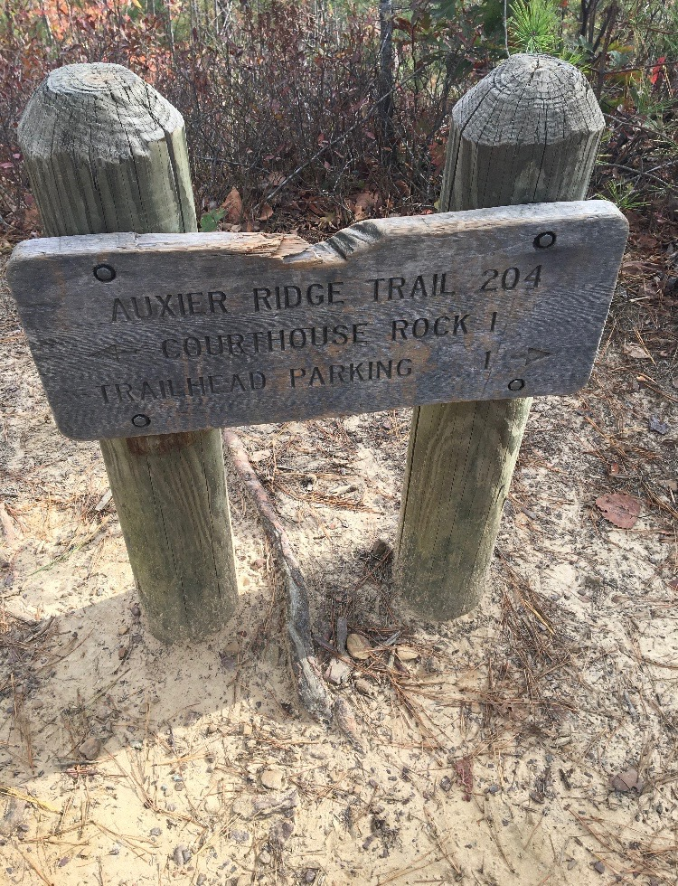
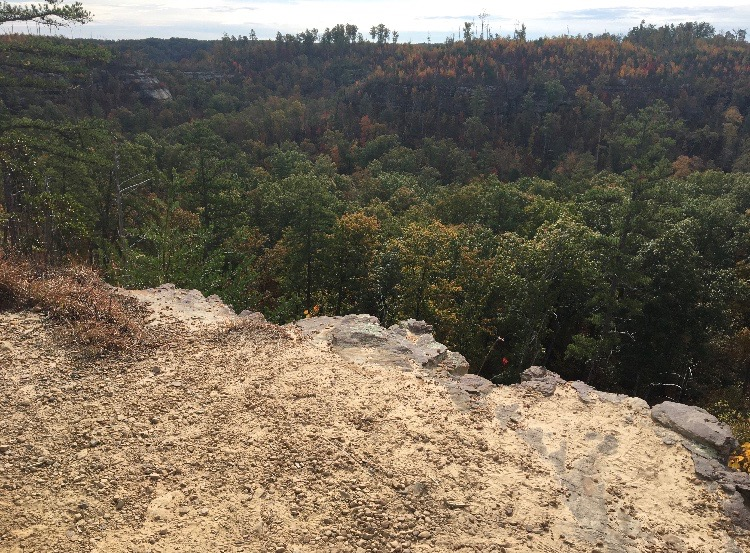
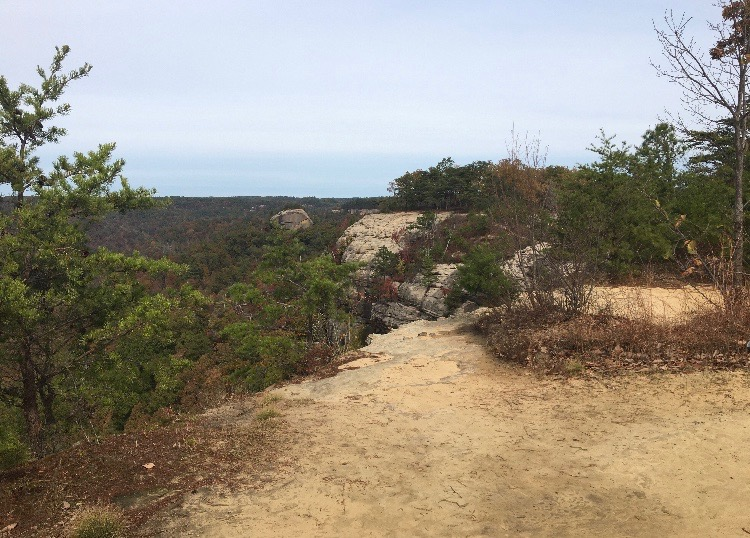
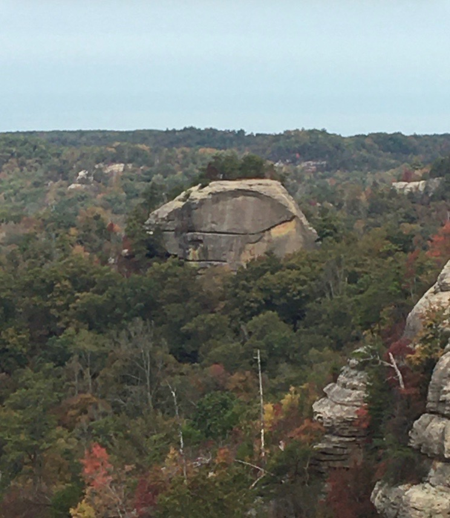
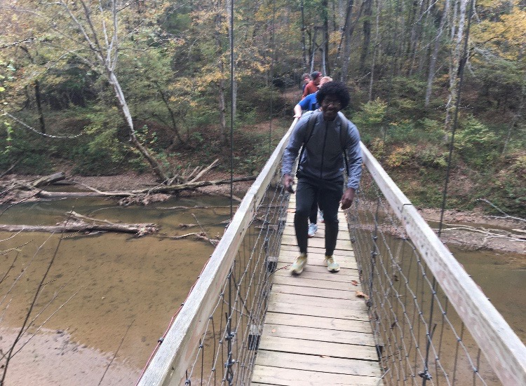
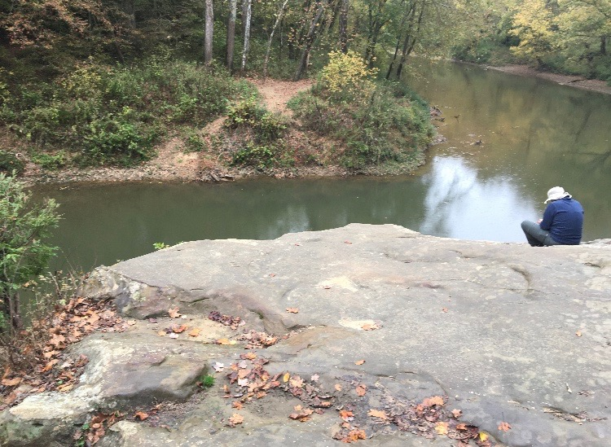

# Field Report: Conner Ledington, November 1st, 2019. Area of interest - Red River Gorge, Kentucky
### We obvserved several features in the Red River Gorge such as Courthouse Rock, Wizard's Backbone, the Suspension Bridge, and Jump Rock. In the field, using our basemaps we estimated the height of Courthouse Rock to be around 100 feet from its base. We found that our field measurements were fairly accurate.

