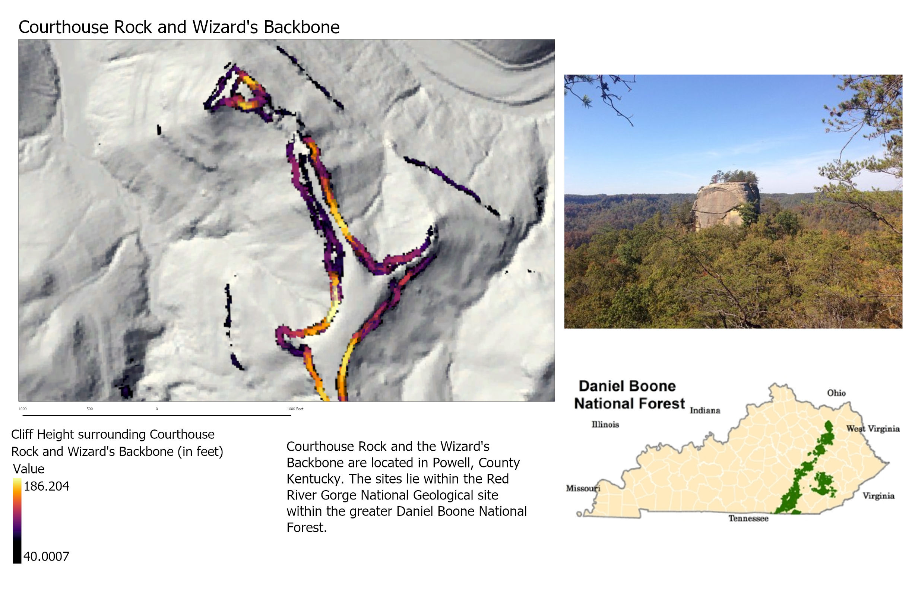
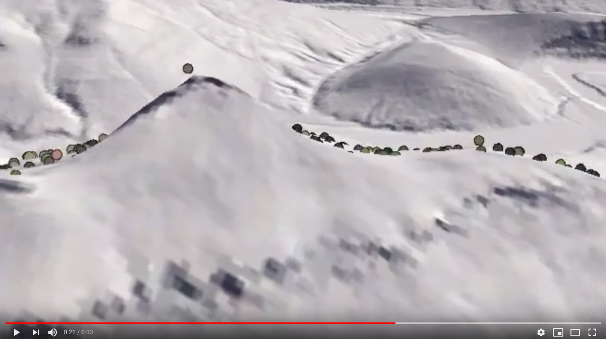

# Cliffs around Courthouse Rock

   
*Estimated cliff heights above 40 ft ([click to enlarge](layoutLab7CHR.jpg))*

## Video
3D fly-around with lidar point cloud filtered for ground points. Bare-earth lidar points are shown over default ArcGIS World elevation layer.

    
*Screen capture of video [click to watch](https://www.youtube.com/watch?v=pzKycMSDcwA&feature=youtu.be)*